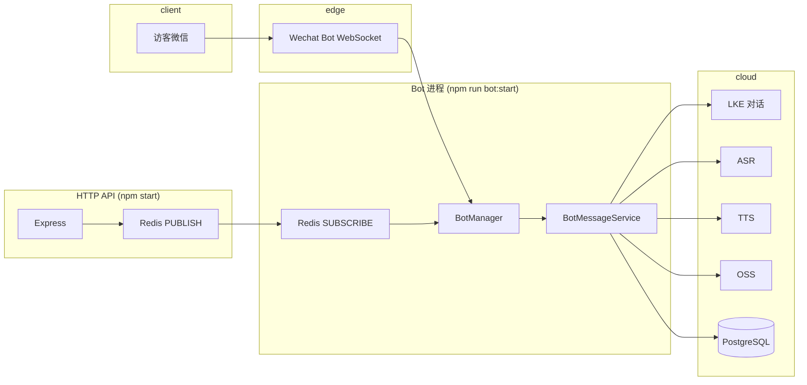

# voice-agent

园区访客微信机器人：语音/文字登记、腾讯 ASR & TTS、LKE 对话、车牌闸机联动（Redis）、登记落库与企微通知。

## 架构

- **API**：闸机/测试接口写 Redis 频道 `bot:control`（如 `scanPlate`）。
- **Bot**：长连网关收消息；拉取访客会话后调 LKE；结构化 JSON 齐全时 `completeSession` 写库，可选推 **企微 Webhook**。
- **数据**：`sessions` / `visitors` 见 `migrations/db.sql`。

## 部署步骤

1. **环境**：Node ≥ 18，PostgreSQL，Redis（默认 `127.0.0.1:6379`，见 `src/utils/redisClient.js`）。
2. **数据库**：配置 `DATABASE_URL`，执行  
   `npm run db:migrate`（会跑 `migrations/db.sql`）。
3. **依赖**：`npm ci`
4. **配置**：复制 `.env`（见下表），勿提交密钥。
5. **启动**（通常两台进程或两个容器）  
   - Web：`npm start` 
   - Bot：`npm run bot:start`
6. **CI**：`npm test`；合并 `master` 后可配置 GitHub Secret `RENDER_DEPLOY_HOOK_URL` 触发 Render（见 `.github/workflows/ci-cd.yml`）。

## 环境变量

| 变量 | 用途 |
|------|------|
| `PORT` | HTTP 端口，默认 `3000` |
| `DATABASE_URL` | PostgreSQL 连接串 |
| `WECHAT_BOT_URL` | 机器人 WebSocket 地址 |
| `WECHAT_WXID` / `WECHAT_TOKEN` | 机器人身份与 HTTP API 鉴权 |
| `WECHAT_BOT_SEND_TEXT_URL` | 发文本 |
| `WECHAT_BOT_SEND_VOICE_URL` | 发语音 |
| `WECHAT_BOT_DOWNLOAD_VOICE_URL` | 下载语音供 ASR |
| `TENCENT_SECRET_ID` / `TENCENT_SECRET_KEY` | 腾讯云 SDK（ASR / TTS） |
| `TENCENT_HOTWORD_ID` | ASR 热词表 ID |
| `TENCENT_TTS_VOICE_TYPE` | TTS 音色 ID |
| `AGENT_APP_KEY` | LKE agent |
| `OSS_REGION` / `OSS_BUCKET` | OSS |
| `OSS_ACCESS_KEY_ID` / `OSS_ACCESS_KEY_SECRET` | OSS 密钥 |
| `OSS_ENDPOINT` | OSS Endpoint |
| `WECOM_WEBHOOK_URL` | 登记完成推保安群 |

## 脚本

| 命令 | 说明 |
|------|------|
| `npm start` | 启动 HTTP API |
| `npm run bot:start` | 启动微信 Bot |
| `npm run db:migrate` | 执行 SQL 迁移 |
| `npm test` | 语法检查 |
